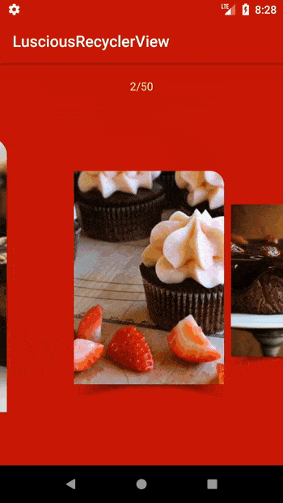

# LusciousRecyclerView
RecyclerView with custom LayoutManager 
 
## Demo
### Screenshot


### gif


## Installation
### Gradle
 (soon)

### Manual
- copy `lusciousrv` folder to your project
- add this line in your `build.gradle`

        compile project(':lusciousrv')
- append this line at your top `settings.gradle`

        include ':your_app', ':lusciousrv'
        
 
## Usage
-  Define it in the XML
```xml
    <me.bluemix.LusciousRecyclerView
            android:id="@+id/list"
            android:layout_width="match_parent"
            android:layout_height="match_parent">
    </me.bluemix.LusciousRecyclerView>
```
- Activity initialization, Adapter and RecyclerView Adapter are exactly the same
```kotlin
    mList = findViewById<LusciousRecyclerView>(R.id.lusciousRV)
    //        mList.setFlatFlow(true); // flat scrolling
    mList.adapter = YourAdapter(this)
    mList.setOnItemSelectedListener(object : LusciousLayoutManger.OnSelected {
      override fun onItemSelected(position: Int) {
        // position = current center item
      }
    })
```

<br><br>
and that's it :)
